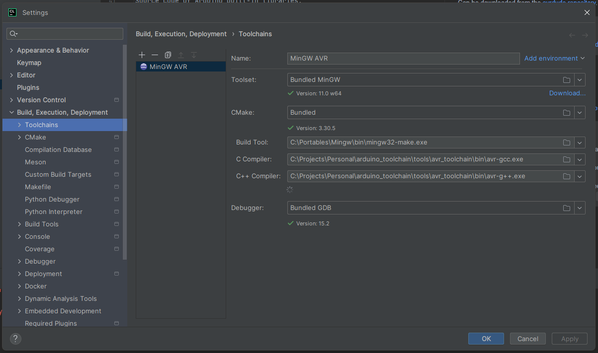
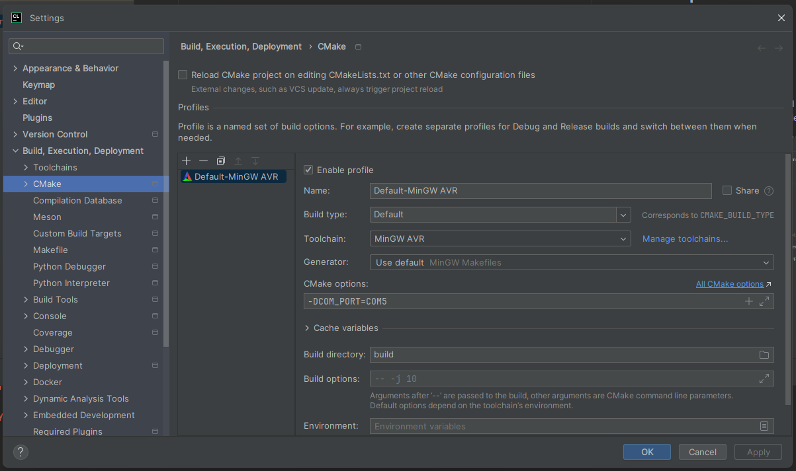

# Arduino Base

Arduino project template with CMake configuration.

## Prerequisites

- Arduino compatible board
- MINGW (Windows only)
- AVR toolchain
- avrdude
- Arduino core libraries

### MINGW

The GCC toolchain contains the `make` executable to build the AVR binaries.

Can be installed from the [official website](https://www.mingw-w64.org/downloads/).

### AVR toolchain

AVR GCC toolchain that contains C, CPP and ASM linkers and compilers as well as ELF to HEX converter.

Can be downloaded from the [Microchip website](https://www.microchip.com/en-us/tools-resources/develop/microchip-studio/gcc-compilers).

> Note
> 
> Toolchain should be downloaded into [tools/avr_toolchain](tools/avr_toolchain) as specified in the CMake configuration.

### avrdude

A program for downloading and uploading the on-chip memories of AVR microcontrollers.

Can be downloaded from the [avrdude repository](https://github.com/avrdudes/avrdude).

> Note
> 
> avrdude should be downloaded into [tools/avrdude](tools/avrdude) as specified in the CMake configuration.

### Arduino core libraries

Source code of Arduino built-in libraries.

Can be downloaded from the [official GitHub repository](https://github.com/arduino/ArduinoCore-avr/).

> Note
> 
> [Arduino core](https://github.com/arduino/ArduinoCore-avr/tree/master/cores/arduino) should be placed into [external/arduino] folder.
> 
> [Arduino variants](https://github.com/arduino/ArduinoCore-avr/tree/master/variants) pin configuration header should be placed into [external/arduino]
> 
> None of these are required and can be omitted. But be sure to remove those source files from the CMake configuration (`Arduino.h` contains `main` function definition that can be in a way).

## CLion setup

### CLion toolchain setup

- Open settings
- Navigate to Build, Execution, Deployment
- Add new toolchain
- Select MinGW toolchain
- Select MinGW `make` executable as a Build Tool
- Select AVR GCC C and C++ compiler binaries that are present in the [tools/avr_toolchain]

### Clion CMake configuration

- Open settings
- Navigate to CMake
- Set name (Optional)
- Set build type (Optional)
- Select previously configured toolchain
- Add `DCOM` variable to select USB device port (COM5 for example)
- Set Build directory to `build`

> After that CMake should build the project and configuration buttons should appear.

## Usage

To upload the code, use the `flash` configuration. 

The toolchain should compile, link and flash the board, all build files including ELF and HEX will be located in the [build](build) folder.

> Note
> 
> Current setup is configured for Arduino Nano and Mini compatible boards with CH340 programmer.
> 
> For other boards the CMake configuration is not guaranteed to work and should be changed.

## Requirements
- [Arduino Core](https://github.com/arduino/ArduinoCore-avr)
- [Software Serial (from Arduino Core)](https://github.com/arduino/ArduinoCore-avr)
- [Wire (from Arduino Core)](https://github.com/arduino/ArduinoCore-avr)
- [Motoron Arduino](https://github.com/pololu/motoron-arduino)
